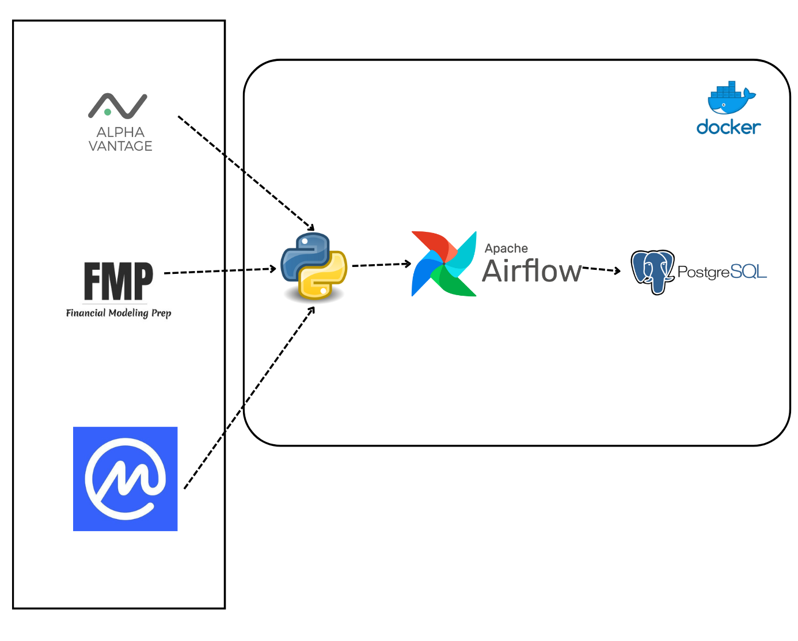

# Stock Data Platform

**Real-time stock data pipeline with Kafka streaming, Airflow orchestration, and a TimescaleDB star-schema warehouse.**

Tracks 10 major tickers (AAPL, AMZN, GOOG, META, MSFT, NFLX, NVDA, TSLA, JPM, DIS) through a fully containerized pipeline — from live market data ingestion to aggregated analytics.

---

## Architecture



```
Market Data API
      │
      ▼
┌─────────────┐    ┌───────────┐    ┌──────────────────┐
│ Kafka        │    │ Kafka     │    │ TimescaleDB      │
│ Producer     │───▶│ Broker    │───▶│ (PostgreSQL 14)  │
│ (live data)  │    │           │    │                  │
└─────────────┘    └───────────┘    │ ┌──────────────┐ │
                                    │ │ dim_company   │ │
┌─────────────────────────────┐     │ │ dim_date      │ │
│ Airflow                     │     │ │ fact_daily    │ │
│ ┌─────────┐ ┌─────────────┐│     │ │ fact_monthly  │ │
│ │Scheduler│ │ Webserver   ││────▶│ └──────────────┘ │
│ └─────────┘ │ :8081       ││     └──────────────────┘
│             └─────────────┘│
│ DAGs:                      │
│  • ETL stock data          │
│  • Populate dimensions     │
│  • Monthly aggregation     │
└─────────────────────────────┘
```

---

## Data Model (Star Schema)

| Table | Type | Description |
|-------|------|-------------|
| `dim_company` | Dimension | Ticker, company name, sector, industry, exchange (SCD Type 2) |
| `dim_date` | Dimension | Year, quarter, month, day, weekend flag |
| `fact_stock_price_daily` | Fact | OHLCV data per ticker per day |
| `fact_stock_price_monthly` | Fact | Aggregated monthly averages and total volume |

Built on **TimescaleDB** for time-series optimized queries on top of PostgreSQL 14.

---

## Services (Docker Compose)

| Service | Image | Port | Purpose |
|---------|-------|------|---------|
| `timescaledb` | timescale/timescaledb:latest-pg14 | 5432 | Data warehouse |
| `airflow-webserver` | Custom (Dockerfile.airflow) | 8081 | DAG monitoring UI |
| `airflow-scheduler` | Custom (Dockerfile.airflow) | — | DAG execution |
| `zookeeper` | confluentinc/cp-zookeeper | 2181 | Kafka coordination |
| `kafka` | confluentinc/cp-kafka | 9092 | Message broker |
| `kafka-producer` | Custom (Dockerfile.kafka) | — | Market data ingestion |
| `kafka-consumer` | Custom (Dockerfile.kafka) | — | Kafka → TimescaleDB sink |

---

## Airflow DAGs

| DAG | Schedule | Purpose |
|-----|----------|---------|
| `etl_stock_data_<ticker>` | Daily | Per-ticker ETL (one DAG per ticker, e.g. `etl_stock_data_aapl`) |
| `populate_dim_company` | On-demand | Load company dimension table |
| `populate_dim_date` | On-demand | Generate date dimension (1990–2035) |
| `populate_fact_stock_price` | On-demand | Seed sample OHLCV facts (test data) |
| `csv_export_dag` | Triggered | Export last 30 days to CSV per ticker |
| `monthly_aggregate_dag` | Monthly | Compute monthly price aggregations |

---

## Quickstart

```bash
# 1. Start all services
docker compose up -d

# 2. Access Airflow UI
open http://localhost:8081   # admin / admin

# 3. Schema is auto-created on first startup.
#    Enable and trigger DAGs in order:
#    - populate_dim_company (first)
#    - populate_dim_date
#    - etl_stock_data_aapl (or any ticker DAG)

# 4. Query the warehouse
docker exec -it timescaledb psql -U data226 -d stockdw \
  -c "SELECT * FROM fact_stock_price_daily ORDER BY date DESC LIMIT 10;"
```

---

## Project Structure

```
├── Dags/                          # Airflow DAG definitions
│   ├── dag_config.py              # Shared DAG defaults and ticker loading
│   ├── etl_stock_data_dag.py
│   ├── populate_dags.py           # Dimension and fact table population DAGs
│   ├── monthly_aggregate_dag.py
│   └── tickers.txt                # Tracked ticker symbols
├── SQL/
│   ├── schema.sql                 # Star schema DDL (TimescaleDB)
│   └── aggregate_monthly.sql      # Monthly rollup query
├── scripts/
│   ├── db_utils.py                # Shared database utilities
│   ├── populate_dim_company.py
│   ├── populate_dim_date.py
│   └── populate_fact_stock_price.py
├── docs/                          # Architecture diagrams (D2)
├── kafka_to_postgres.py           # Kafka consumer → TimescaleDB
├── live_from_kafka.py             # Real-time Kafka producer
├── Dockerfile.kafka               # Shared Kafka producer/consumer image
├── Dockerfile.airflow             # Custom Airflow image with dependencies
├── docker-compose.yml             # 7-service orchestration
├── .env.example                   # Environment variable template
└── requirements.txt
```

---

## Tech Stack

- **Streaming**: Apache Kafka (Confluent) with Zookeeper
- **Orchestration**: Apache Airflow 2.7
- **Database**: TimescaleDB (PostgreSQL 14 + time-series extensions)
- **Containerization**: Docker Compose (7 services)
- **Language**: Python
